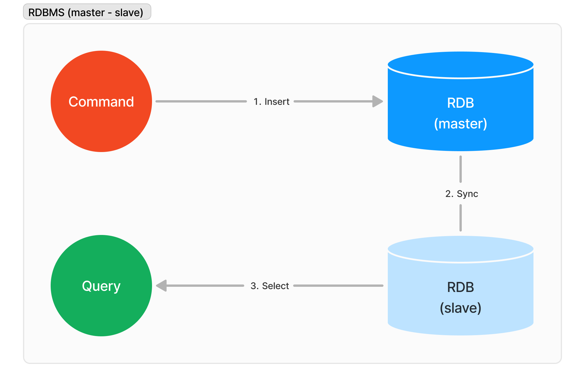
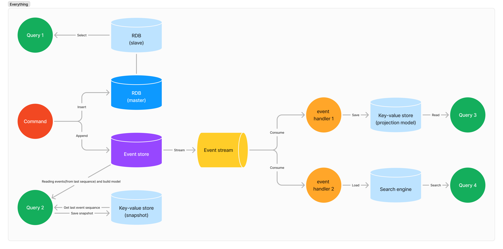

## Introduction

In this repository, I will demonstrate how to implement CQRS (Command Query Responsibility Segregation), DDD (Domain-Driven Design), and Event Sourcing patterns using the NestJS framework. These patterns can significantly help in managing complex business logic, improving scalability, and maintaining a clean architecture in your applications.

While there are many high-quality articles on the theories behind these patterns and strategies available online, this guide aims to provide a practical, hands-on example.

Join me as I delve into the intricacies of CQRS, DDD, and Event Sourcing with NestJS, offering valuable insights and practical examples to help you implement these patterns effectively in your projects.

## CQRS

> CQRS (Command Query Responsibility Segregation) is a pattern that separates the models used to update data (commands) from those used to read data (queries). This separation can be useful in complex domains and high-performance applications, allowing for independent scaling and optimization of read and write operations. However, **CQRS adds significant complexity and is only suitable for specific parts of a system.** Most systems that fit a CRUD model may not benefit from CQRS. Properly evaluating the domain and application needs is crucial before implementation.
> <br> <br>For more details, visit [Martin Fowler's article on CQRS](https://martinfowler.com/bliki/CQRS.html).

- Separating the read model, its database, and even read-only servers will significantly increase system complexity.
- I recommend using a highly segregated CQRS system only when absolutely necessary.
- Don't apply it everywhere. It's enough to use it where needed. Let's avoid the trap of overengineering.

## Event Sourcing

> Event Sourcing is a way to persist state changes as a sequence of events rather than storing the current state. Each event represents a state change and is stored in an append-only event log. **This pattern allows rebuilding the current state by replaying events**, provides a natural audit log, and facilitates debugging by allowing developers to see exactly what happened in the system. It can also support complex scenarios like temporal queries and retroactive corrections.<br> <br>For more details, visit [Martin Fowler's article on EventSourcing](https://martinfowler.com/eaaDev/EventSourcing.html)

- There's a big difference between simply streaming and consuming events and storing events for later use.
- You can reassemble data from a specific point in time or create different models from a single source as needed. It’s also useful for monitoring and debugging.
- If you're already streaming and consuming events, consider storing them as well. It can make solving complex problems easier.

## DDD

> Domain-Driven Design (DDD) is an approach to software development that emphasizes the importance of a domain model, which is a rich understanding of the business processes and rules. Originating from Eric Evans's 2003 book, DDD involves creating a Ubiquitous Language that integrates domain terminology into software systems, evolving models over time, and categorizing objects into Entities, Value Objects, and Service Objects. Strategic Design in DDD includes **organizing large domains into Bounded Contexts**, providing a structured way to handle complex domains.<br> <br>For more details, visit [Martin Fowler's article on DDD](https://martinfowler.com/bliki/DomainDrivenDesign.html).

- If the project’s scale or complexity isn't significant, this highly structured pattern might be unnecessary.
- Applying this pattern to an immature project is risky because once it's implemented, it becomes very difficult to dismantle and reassemble if the domain scope and boundaries change significantly.
- The best time to apply this pattern is during a major refactoring of an established project with messy code, introducing it gradually.

## Strategies for managing data

### RDBMS (master - slave)

<div style="text-align: center;">
  
</div>

- This structure is very simple, and some may not consider it as CQRS.
- But does it really matter? This structure is likely the most suitable for most projects and it ensures the safest and most reliable improvement in read performance.

### Event stream + Event handler + Key-value store(projection model)

<div style="text-align: center;">
  
</div>

- This structure is very effective when the read model is complex and requires a lot of data joins and processing.
- The key-value store will have eventual consistency
- The complexity of the system and the difficulty of monitoring and handling failures will increase.

### Event store + Event sourcing

<div style="text-align: center;">
  
</div>

- All state changes in the system are stored in the event store, and the system operates based on this event data.
- Various forms of model assembly are possible. In particular, it allows for the flexible assembly of data at specific points in time or under specific conditions.

### Event store + Event sourcing + Key-value store(snapshot)

<div style="text-align: center;">
  
</div>

- Assembling all events from the beginning to the present each time to calculate the current state may be unnecessary.
- This issue can be resolved by storing snapshots, and for more detailed explanations, it is recommended to refer to this article[(CQRS with Amazon DynamoDB)](https://aws.amazon.com/ko/blogs/database/build-a-cqrs-event-store-with-amazon-dynamodb/).

### Everything

<div style="text-align: center;">
  
</div>

- There is no one right answer! No single approach needs to be applied!
- Consider and apply the strategy that best suits your service (or a specific part of it)!

## Getting started

### Prerequisites

- Install node.js: https://nodejs.org/en/download/
- Install docker desktop for mac: https://docs.docker.com/docker-for-mac/install/
- Install docker desktop for windows: https://docs.docker.com/docker-for-windows/install/
- Install docker compose: https://docs.docker.com/compose/install/

### Script

**Fetch codes**

```
git clone https://github.com/kimyh03/nestjs-cqrs-ddd-example
```

**Install packages**

```
npm install
```

**Run databases**

```
docker compose up -d
```

**Run**

```
npm run start
```

## Links

- NestJS: https://nestjs.com/
- EventStore DB: https://www.eventstore.com/
- Martin Fowler
  - CQRS: https://martinfowler.com/bliki/CQRS.html
  - DDD: https://martinfowler.com/bliki/DomainDrivenDesign.html
  - Event sourcing: https://martinfowler.com/eaaDev/EventSourcing.html
  - Event driven: https://martinfowler.com/articles/201701-event-driven.html
- Microsoft
  - CQRS: https://learn.microsoft.com/en-us/azure/architecture/patterns/cqrs
  - Event sourcing: https://learn.microsoft.com/en-us/azure/architecture/patterns/event-sourcing
- AWS
  - CQRS with Amazon DynamoDB: https://aws.amazon.com/ko/blogs/database/build-a-cqrs-event-store-with-amazon-dynamodb/
